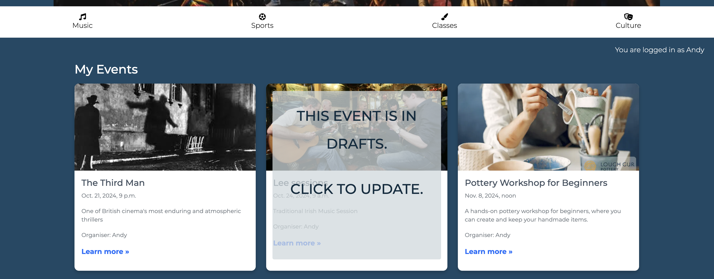
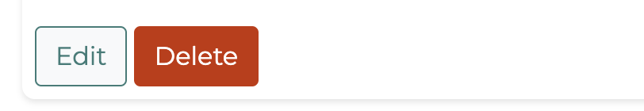
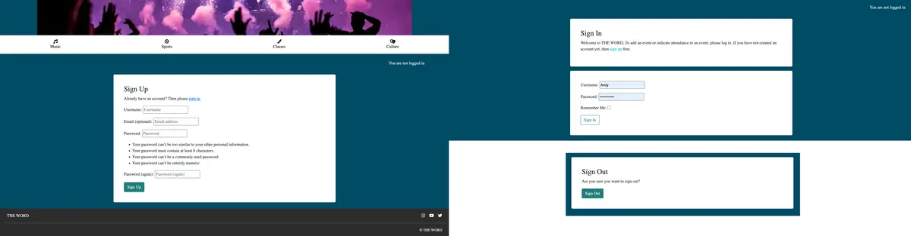
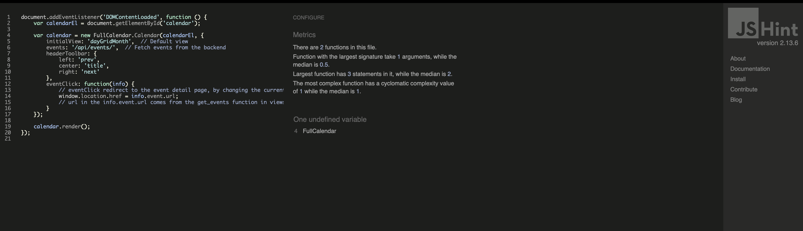

# THE WORD 

[Andy O'Dwyer github](https://github.com/Andrewodwyer)

### Live App

[Link to THE WORD site](https://events-blog-f44bf5c7d7d5.herokuapp.com/)

### App description

<hr>
The Word is a local events app that allows user to view event listings. It utilises two main search options, 1. by category and 2. by date on a calendar view. The app encourages users to sign up to gain the additional benefits of posting their own events, commenting on upcoming events and RSVPing.

## Table Of Contents:
1. [UX & User-Centred Design](#ux)
    * [User Centred Design](#User-Centred-Design)	
    * [Target Audience](#target-audience)
    * [User Goals](#user-goals)
    * [User Stories](#user-stories)
    * [Database Diagram](#database-diagram)
    * [Kanban](#kanban)
    * [Typography](#typography)
    * [MoSCow Prioritisation](#moscow-prioritisation)
    * [Epics](#epics)
    * [Story points](#story-point)
2. [UI](#ui-design)
    * [UI Design](#dui-design)
    * [Wireframes](#wireframes)
    * [Design](#design-style)
    * [Colour Palette](#colour-palette)
    * [Typography](#typography)
3. [Features](#features)
    * [Navigation](#navigation)
    * [Footer](#footer)
    * [Home page](#home-page)
    * [Event Calendar](#event-calendar)
    * [Create an Event](#create-an-event)
    * [My Events](#my-events)
    * [CRUD](#crud)
    * [DRY principles](#dry-principles)
    * [Authentication and Authorisation](#authentication-authorisation)
4. [Technologies Used](#languages)
    * [BootStrap](#bootstrap)
5. [Libraries](#libraries)
6. [Testing](#user-testing)
7. [Bugs](#bugs)
8. [Deployment](#deployment)
9. [Credits](#credits)


## UX
<a name="ux"></a>

### User-Centred Design Approach for planning and design.
<a name="ucd"></a>

The primary goal in the planning and design of the Events App is to create an intuitive, user-friendly experience that addresses the needs of its primary users, event seekers and event organisers. Insuring that every design decision is made with the end user in mind, focusing on making the app both functional and enjoyable to use. 

#### Target Audience
<a name="target-audience"></a>

The Word’s events platform is designed for people who are interested in discovering, attending, and organising local and online events. The app concept is like a bulletin board in a shop or office space. People can post and see events in the local area. In the same way this site encourages users to both search for events and post their own events. 

The Word is geared to both casual event attendees and engaged organisers / registered users, providing a platform that encourages social engagement and participation. Through the comment and attending sections on each event page.

Information on users:
- Age: There is something for all ages, from art and crafts to live music. 
  - User are anyone with access to the app
  - However the apps expected user will be over 18, due to a lot of music venues having age restrictions. Secondly, perents will be the ones researching classes and events for their children.

Location: 
- The intention of the app is to have one for each city e.g THE WORD Cork/Waterford/Dublin/Limerick etc. In this way the user will utilise an app relevant to their location.

Users interests in finding information in numerous categories
- Music
- Sport
- Classes
- Culture

Regular user who add content:
- The registered user or organiser are interested in creating and managing their own events, either as a hobby or professional service.


#### How people will use the app:

- None Registered Users
  1. Users who are interested in seeing local events, what’s on now and in the future.
  2. Users that want to search by a certain category, Music, Sports, Classes and Culture. 
  3. People that want to choose an event by a certain date. Viewing upcoming events on a calendar.

- Registers Users
  - They will have the same abilities as the none registered users plus the following.

  4. Add their own event
  5. Update and delete their event
  6. See a list of event they’ve created
  7. Indicate if they will be attending an event
  8. Write a comment or ask a question on an event
  9. Edit and delete their comment/question


#### Why users will use the app:

-  Search flexibility: 
   - Users can easily search for events through categories (music, sports, classes, culture) and dates, improving event discoverability.

-  Event attendance: 
   - Registered users can indicate whether they plan to attend an event, which enhances event visibility and participation.
   - Organiser can also track interest

- User-generated content: 
   - The site allows users to create, read, edit and delete their own events. They have the ability to create events and manage details like location, time, and description.

- Engagement through comments: 
   - Registered users can leave comments on event pages, encouraging engagement and conversation around events.

### User Goals
<a name="user-goals"></a>

For Attendees: 
- Users primarily visit The Word to discover new events that match their interests and schedule.
- They want a streamlined way to browse events, show attendance, and possibly engage in discussions with other attendees.


For Organisers: 
- Users who create events are looking for an easy way to promote their events, manage their listings, and interact with potential attendees. The platform’s CRUD (Create, Read, Update, Delete) functionality provides them with the flexibility to create, edit, or remove events as needed. Giving them full control over their event.

### User Stories
<a name="user-stories"></a>
The user stories are available on the kanban board and some will be discussed in the EPICs below.
There as three main users
- Admin: These are the site owner that will have full control over the publishing of events, and comments.
- Registered Users: User and organisers who are logged in, allowing for more functionality 
- Non-registered users: limited functionality
These users have been grouped in the kanban board with tags and their user stories have been given epics for each type of user

### Database Diagram
<a name="database-diagram"></a>

One of the first steps in producing this app was to design and implement custom models based on the information that users would want to store and access.

An entity relationship diagram was created of planning these custom models.

As you can see from the ERD, the relationships plays a important role in how the information will be stored and accessed. Here are the main relationship and you'll also be able to view them in this Diagram

- Category model:
   - One-to-Many: A category can have many events (AddEvent model), but each event belongs to one category.

- AddEvent model:
  - One-to-Many: A single category can be associated with multiple events.
  - One-to-Many: A single user can create multiple events, but each event has one organiser.
  - One-to-Many: An event can have multiple comments, but each comment is linked to one event.

- Comments model:
  - One-to-Many: A single event can have many comments, but each comment is linked to one event.
  - One-to-Many: A single user can write many comments, but each comment is linked to one user.

- Attending model:
	- Many-to-Many: A user can attend multiple events, and an event can have many attendees.

- User:
  - One-to-Many: A single user can create multiple events.
  - One-to-Many: A single user can comment on multiple events.
  - Many-to-Many: A user can attend multiple events, and events can have multiple attendees.


## Kanban
<a name="kanban"></a>

For this project I created a Kansan board in GitHub to display the stages and status of each user-story. I assigned priority to each user-story using the MoSCoW method. The User-story were grouped into Epics and each User-story was given a Story Point using the T-shirt Sizing method. 

### Kanban boards in github project:
- MoSCow Prioritisation
- Epics to group user-stories
- Story Points: to estimate the work required
- Status: What stage it’s on.

## MoSCow Prioritisation
<a name="moscow"></a>

##### M: Must Have
 - Non-negotiable product needs that are mandatory.
 - Deciding factors for Must haves: 
  - What will happen if this is not included
  - Is there a simpler way to accomplish this?
  - Will the product work without it?

##### S. Should-have
-  They are essential to the product/project but they are not vital. The product will still function without it. However, the addition will add significant value. They can be scheduled for a future date.

##### C. Could-haves 
-  Nice to haves. Not necessary to the core function. They have a much smaller impact on the outcome if left out. They will be the first to be deprioritised.

##### W. Will not have
- This manages expectations and prevents scope creep. They are not expected in this specific time frame.

<br>

<details><summary><b>MoSCoW Prioritisation Image</b></summary>


</details>

## Epics
<a name="epics"></a>

In a Kanban board, an epic is a large body of work that can be broken down into multiple smaller user stories and tasks. Each epic generally corresponds to a specific area. The epics are organised by three types of users in the system: Admin, Registered Users, and Non-Registered Users.

Below is a description of each epic based on the user roles in your system:

#### Epic 1: Admin

This epic groups together all the functionality and user stories related to the Admin role. The Admins are users who have the highest level of access and can manage various aspects of the app. Their stories will involve managing users, events, comments and who is attending each event. 
- Abilities:
  -	Admins can create, edit, or delete user accounts
  -	Admins can create, approve, edit, and delete events, comments and attendance submitted by registered users.
  -	Admins have the ability to review user-generated content in an admin panel

- Example User Stories:
  -	“As the Admin I can view event request and comment requests, so that I can review and approve them”
  -	“As an Admin, I want to approve or reject registered users publishing events so that only verified events are added to the app”

#### Epic 2: Registered User

This epic encompasses all the features and interactions available to Registered Users. These users have accounts and have increase abilities over non-registered users.
- Abilities:
  -	Registered users can create new events and submit them for admin approval.
  - Registered users can view, show attendance, and write comments on events.
  -	My Events: Registered users can see the events they've created.
  - They have CRUD functionality
    - Adding an event (editing the event),
    - Writing a comment / ask a question (edit the comment / question),
    - Show attendance (indicate attendance and also remove attendance)

- Example User Stories:
 - “As a user I can log in to my account so that I can add events, comment and indicate attendance”
 - “As a Registered User, I want to comment on events so that I can share my opinions or ask questions.”

#### Epic 3: Non-Registered User

This epic covers the functionality accessible to Non-Registered Users, or users who visit the platform without signing up. These users have limited access compared to registered users but can still interact with the app to a certain degree.
- Abilities:
 - Event Browsing: Non-registered users can browse through public events without needing an account.
 - Category Search: Non-registered users can search for events based on categories and dates in the calendar
 - View Event Details: Non-registered users can view the full details of a specific event, including descriptions, dates, locations, and organiser information.
 - Limited Interaction: While non-registered users cannot create or participate in events, they can view event information and are prompted to sign up for further actions.

- Example User Stories:
	- “As a user I can open a event listing from the calendar so that see more details of the event”
	- “As a User, I want to browse and search for events so that I can find events that interests me.”

Each of these epics groups together the relevant user stories under a common theme, making it easier to manage and visualise progress on the Kanban board. The Epics are grouped using Tags on the User Stories eg. Tag: "Epic 1: Registered Users"


[View Kanban Board here](https://github.com/users/Andrewodwyer/projects/6)


## Agile Story points
<a name="story-point"></a>

Story points are a unit of measure used in Agile project management in Scrum, to estimate the relative effort or complexity of user stories or backlog items.
Instead of estimating in terms of time (e.g., hours or days), which can be subjective and vary based on individual team members’ skill levels, story points focus on the overall effort or complexity involved. Story points represent a combination of factors, including the effort required, technical complexity, risks, and dependencies.I have used T-shirt Sizing for this.

- Some example of using Story Points:
	1.	User Story: “Manage My Own Posted Events” (Registered User)
	 - T-shirt Size: M (Medium), Story Points: 3
	 - Reason: A registered user managing their posted events involves creating, editing, or deleting events, which requires interaction with multiple parts of the system (the database, html, views etc.).

  2.	User Story: “View Comments” (Admin)
	 - T-shirt Size: XS (Extra Small), Story Points: 1
   - Reason: Django admin panel is set up for this with minimal adjustments

  3.	User Story: “View Calendar” (Non-Registered User)
	 - T-shirt Size: L (Large); 	Story Points: 5
	 - Reason: Viewing a calendar html and include events title based on dates. This involved an external library called FullCallendar. To make the events show in the calendar was a complex feature requiring significant development time, particularly in the use of JS, views and uls. JsonResponse was required.

By using T-shirt size Agile story points, you can effectively estimate the workload for each epic and user story

<details><summary><b>T-shirt size Story Points</b></summary>


</details>

<br>

## UI Design
<a name="ui-design"></a>

The initial wireframe was designed using figma. The figma project page can be found here [FIGMA THE WORD](https://www.figma.com/design/xioX2poOx76Zg7R8lG8Ret/The-Word!-Events?node-id=218-1347&node-type=frame&t=6gK5eYLXELZdjBK1-0)

## Wireframes
<a name="wireframes"></a>

#### Mobile Wireframe


#### Desktop Wireframe


### Design Style
<a name="design style"></a>

The UI design for the app was to be a modern, clean and userfriendly. Balancing functionality and aesthetics, so the user can easily navigate through the app.

#### Colour Palette:
<a name="colour-palette"></a>
- Primary background colour of dark blue #1B4965. 
  - Giving a strong rich coloured canvas for the event cards. By doing this the cards stand out and draws the users eye inward.
- Accent Colours: Orange and teal-green for the action buttons.
  - It balances well with the darker and neutral colors of the site, maintaining a professional tone while being inviting.
- Neutral Colors: light & slate greys. 
  - Not distracting or overpowering. They are in keeping with the design and are easily read.
- White
  - Background colour of the cards, making them pop from the background.

<hr>


#### Typography:
<a name="typography"></a>
- Font Bondoni Moda SC, Serif
  - The choice of a serif over a more modern font was a nod to the past, or an acknowledgment of Djangos start. The idea that news was initally printed in serif.

### Logo
- The logo is made up of 2 parts.
  - 'W' 
  - 'THE WORD' text

- I used favicon.io to create the “W” icon for the website. The colour and font matching the design.

### Favicon

- Designed in favicon.io

## Features:
<a name="features"></a>
### Navigation
<a name="navigation"></a>

- The Navbar contains 6 links when the user is not signed in and 5 links when they are
  - All Events
  - Calendar
  - Create an event
  - My events
  - Register, This button is not visible when logged in
  - Login / login changes to logout when the user is logged in

There are the main option in the app and the most relevant to any user, whether they are a registered or non-registered user.


- This is a Bootstap NavBar that has it's own JavaScript for the hamburger menu on smaller devices.

- The links are grey when not active and black when active. The user will always know where they are on the app.

- I decided to keep the categories section separate to the navbar for a more aesthetic design. This design is familiar to other event sites, making it intuitive.


### Footer:
<a name="footer"></a>
- Dark-Grey Background with white text ensures that the footer remains subtle but clear. It contains social media links, styled with white icons against the dark background, providing easy access to external community pages without dominating the page design. External links on the footer is expected and would be the area users would look for them.


### Home Page
<a name="home-page"></a>
- The home page uses the base.html, event_card.html and pagination.html together, allowing for a fluid theme throughout the app
- Logo, "W" and "THE WORD" displaying the brand, immediate recognition of the app. Users feel more comfortable when they are reassured by the brand.
- Hero section. This image signals the purpose of the app and the text in the white box "FIND YOUR EVENT" is a clear call to action, encouraging users to begin browsing for events.
- Category. The location and use of icons makes it easy and familiar to the user when selecting a category
- Grid Layout for Events. Each page contains 6 event cards so not to overwhelm the user
- Pagination button, to show where the user is at any time


### Event Calendar
<a name="event-calendar"></a>
- Displays the events on a Calendar
- Like google calendar a time/date and event title is added to the days/dates in the chosen month
- FullCalendar was used
- Base.html used for UX
- Users can click on the event title to be brought to the event details page

### Create an Event
<a name="create-an-event"></a>
- A form for the user to add their event details
- Displayed using Crispy-form
- Image upload using cloudinay
- Once the event is submitted, a message displays to indicate to the user that the event has been submitted.
- If the form is missing required information or if it has not been filled out correctly, a message will display regarding the issue to correct.


### My Events
<a name="my-events"></a>
- A grid display of your events as cards, like the home page
- Events that are not published/ in drafts have a transparent element over then to indicate that it is not published. Image below
- Both published and draft events can be clicked on and edited/deleted
- If the user is not logged in, they will be brought to the sign in page




### Register
- Sign up page if the user does not have an account
- A form page that requires: username, email(optional) password and password confirmation. Details regarding passwords are displayed
- A message will be displayed if the there is an error with the form.
- When registered, the user will then be redirected to the home page with a message "Successfully signed in as USERNAME."

### Log out
- This page contains a message "Are you sure you want to sign out?" and a button
- The user is redirected to home page after signing out

### log in
- Message displayed in a container
- Container with form for username and password.
- Sign in button will direct the user to the home page if the form is correctly filled out.

## CRUD
<a name="crud"></a>
The Events App’s CRUD functionalities for events, comments, and attending are designed to give logged in users control over their interactions with the app.
The list below has CRUD abilities for the registered user
| **Entity**    | **Create**                               | **Read**                                   | **Update**                               | **Delete**                               |
|---------------|------------------------------------------|--------------------------------------------|------------------------------------------|------------------------------------------|
| **Events**    | Event organisers can submit new events.   | Users can view event lists and details.     | Organisers can edit their own events.    | Organisers can delete their own events.  |
| **Comments**  | Logged-in users can post comments.        | All users can view approved comments.       | Logged-in users can edit their own comments.       | Logged-in users or admins can delete comments.     |
| **Attending** | Logged-in users can RSVP to an event.               | Logged-in users can view attendance.   | Logged-in users can change their RSVP status.      | Logged-in users can remove their RSVP.             |

## DRY principles
<a name="dry-principles"></a>

#### Three main benefits: Reusability, Maintainability & Customisation

### HTML Template inheritance

#### base.html

The base.html keeps the look and feel of the site consistent. 
Template inheritance goes hand in hand with DRY principles - Don't Repeat Yourself. Using inheritance, we only need to write them once. After that, we can inject the content from each page into named blocks. 

This extends tag   tells each .html that it is a child template of base.html. Unique html to each page is injected into the base.

I use this base.html for all pages to create the same look and feel for all our pages. The base.html template however is not the only one that can be reused. After writing each pages Html I saw there was other pages that could reuse code. There pages were
- index.html (home page)
- events_by_category.html
- my_events.html

#### Pagination:
Pagination, meaning "divide up into pages”.
paginate_by = 6,  tells Django to display 6 posts at a time.
is_paginated is a boolean (set to true) more than the paginate number that was set to 6, add pagination. paginate number was set in the app view.py
    template_name = "event/index.html"
    paginate_by = 6
I first used this just on the index.html (home) page. As the same pagination would be used on 3 html pages (index.html, events_by_category.html and my_events.html) I decided to place the pagination in its own template called pagination.html and include it in those 3 pages using the  tag.        
. 
The page_obj contains the current page’s events and pagination details if there is a next or previous

#### Event Card Display
Like the Pagination on these pages the majority of the code was the same. The only major difference was the h3 element at the start of the page and a message that displays at the end of the page  statement
The card_display.html template was created in response to this. This template used the code that was duplicated on each page. These pages are free of clutter and the card design need only be changed once in the event-card.html and would apply on all the relevant pages that had the  tag.


### Cards
- In keeping with the dark background the cards are white to standout, indicating importance. 
- The card displays an image with text under it. There is a "Learn more" link element that is a "signifier" to click to view more information. I saw this style link on apples website. The classic blue style link is a perfect signifier, separating itself from the other text.
- I have made the whole card a link even though it looks like the blue "Learn more" is the link. This was done to make it easier for the user to move to the next page. All designed with the user in mind. 
- There is a slight drop shadow on the cards as well to elevate it.


### Buttons and Icons
<a name="buttons-and-icons"></a>
The action buttons like sign up, edit, delete and next/previous are solid colours when inactive and white with colour text and border when hovered over.
This was due to the type of button is was. Once clicked they were gone. 
- The icon buttons for the categories and attending buttons are differnet however. 
  - The categories are on a white bar and would be distracting if they were block colours initially. Once a category is active its colour needs to inform the user of their location with a obvious sign. A quote from Steve Krug from his book "don't make me think" 
    - “The fact that the people who built the site didn’t care enough to make things obvious—and easy—can erode our confidence in the site and the organization behind it.”
  - Icons provide a visual shortcut

- The icons are from [fontawesome](https://fontawesome.com/)
<hr>





### Design familiarity
  - Attending button: Just like the categories buttons, this had to be obvious. There are many apps with this idea of liking or attending. This grey to green concept is intuitive. This leverages the users prior experiences, making it feel familiar and natural.
  <hr>


### Authentication-Authorisation, User Interaction with messages & signafiers
<a name="authentication-authorisation"></a>

- Authentication is the process of verifying a user’s identity when they log in or register for the first time.
  - Django Allauth is used for user authentication and registration, providing pre-built views and forms for registering new users.
- Authorization defines what a user is allowed to do once authenticated. In this app, different actions are available based on whether the user is logged in and whether they own specific resources

- Information/Messages: When an action is preformed, like creating a comment or event, a relevant message displays to the user. These are styled to blend smoothly into the page without overwhelming the user.
- Authentication Indicators: Users are reminded whether they are logged in or not through a simple text message displayed to the left of the screen near the header.


### Bootstrap
<a name="bootstrap"></a>
Bootstrap was used in the app to create a responsive, mobile-first websites quickly and efficiently using it's library. Bootstrap provides a collection of pre-designed HTML, CSS, and JavaScript components, like buttons, forms, navigation bars, and grid layouts. By using Bootstrap, I was able to build a visually consistent app without writing extensive custom code. It was easy to customise and it adapted to all screen sizes without having to write additional media queries. Saying this, I did customise the css and added js in this build.


### Additional App Features
<a name="additional-features"></a>
1. Event Browsing and Filtering 
- Filter by category
- Filter by calendar view. Events are displayed in the calendar dates
- View the events you've created

2. User Authentication
- Users can register, sign in and sign out
- Registered users have additional benefits: add events, comments and indicate attendance

3. Create Events
- This feature encourages users to actively contribute on the app, creating a sense of community and ownership. 

4. Category Icon:
- Discuss earlier

5. Interactive Calendar View
- Users can see upcoming events on a specific date
- Clicking the event title (link) brings the user the event details page
- Beneficial for users that only want to see events by date that they're available for.


6. Event Interaction
- Mark as Attending
- The click icon turning from grey to green provides a sense of accomplishment and interaction enhancing the user experience

7. Comments
- Organiser can update the event with a comment.
- A user can ask a question or comment.
- Benefits to the user as they feel more connected to the event

8. Social Media
- Links to social media were the app and event can be more visible 

9. Image display. 
- The organiser when creating the event can add their own image. 

10. Additional information from the Organiser aids to better Search Engine Optimisation


### Libraries
<a name="libraries"></a>

- Django-cloudinary-storage: handling the images
- Crispy-forms: making it easier to work with forms, providing better rendering and handling.
- Django-summernote: Handling text
- Crispy-bootstrap5==0.7 - A Crispy Forms template pack for Bootstrap 5

### Manual Testing user stories

<a name="user-testing"></a>

User Story |  Test | Pass
--- | --- | :---:
As a Site Admin I can view comments on an individual post so that I can read the conversation | In admin panel click on comments tab and select comment | &check;
As admin I can mark addevent and comment requests as read so that I know which ones I've seen | In admin panel click on comments tab and select box at the start of the comment | &check;
As the Admin I can view event request and comment requests, so that I can review and approve them | In admin panel click on comments tab or Add events tab and select item event or comment you'd like to review and approve | &check;
As a Registered User, I want to indicate my attendance to events so that others know I’m planning to go. | Login, select event, click on the attending icon | &check;
As a user/event organiser I can view all the events I've created so that I can manage them | login, in the nav bar click My Events, select one of your events | &check;
As a user I can see the nav-bar so that I can easily go back to the home screen | Only when events are no longer available, past events that are moved to draft or deleted | &check;
As a user I can log in to my account so that I can add events | log in, click the link Create an Event, fill in form and submit | &check;
As a site user I can create, update and delete events | Once logged in, click on My Events page, select the event to edit or delete. Once in the details page, press the edit or delete button, delete button will display a modal to confirm delete. Edit button will bring you to a form page with the current input information. Edit event details and submit. If selecting delete, a bootstrap modal is shown with two buttons, close and delete. Close, closes the modal, delete deletes the event| &check;
As a Registered User, I want to comment on events so that I can share my opinions or ask questions. | login, select the event you'd like to comment or ask a question to, and click submit | &check;
As site user I can view events in a paginated way so that I can select one that interests me. | on the home page, category page or my events page, you'll see a button under the events. The button is numbered relating to current page and an arrow for next or previous | &check;
As a user I can open a event listing from the calendar so that see more details of the event | Click on the Calendar button on the nav-bar, select the date that has a event listed by title. Click title and you'll be brought to that event details page | &check;
As a User, I want to browse and search for events by category so that I can find events that interest me. | User chooses a category from the category tab. Choose one of the four buttons. User sees a new listing of filtered events by that category| &check;
Sign up prompt. As a non-registered user I can register for an account so that I add events, write comments & show attendance | Non logged in users will be directed to the sign in page when click create an event, my events or indicate attendance | &check;
As a user/ site visitor, I want to browse events without needing to register so that I can see what’s happening in my area. | all users can see the events by all, category and calendar | &check;

### User registration, sign in and log out


### Manual Testing features

| Feature | Action | Status | 
|:-------:|:--------| :--------|
| Register | Selected Register on the nav menu, input Username, Email(optional), password, password again to confirm they are identical, click sign up. Redirected to home page if correctly done. Message to show what additional steps if not successful | &check; |
| Login | Select Login from the nav menu, input username and password, click Sign in button. Redirected to home page if no issues. A message "The username and/or password you specified are not correct." if you are a new user or inputs are incorrect | &check; |
| Logout | Select logout from nav menu, click sign out, redirected to home page | &check; |
| Filling in create event form | Registered users click create an event button, Fill in the required fields in the form, submit event. There is a message to indicate that the event was successfully created. If there is an issue with the required fields, a message will be displayed to show the issues | &check; |
| Add a comment to an event | In the event details page under the event description is a comment field. Make a comment and click the button submit. The user will be returned to that event page and a message will be displayed so the user knows the comment has been sent to be reviewed before being published | &check; |
| Edit and delete comment | This created comment can be edited or deleted by the comment writer. They will see two buttons, edit and delete. Clicking edit will display the previously submitted commend in the comment field to be edited and submitted again. Clicking delete will bring up a bootstrap modal to confirm delete. Two buttons are displayed on the modal. close or delete | &check; |
| Social media links| links in the footer takes the user to the relevant websites | &check; |
| Admin panel view | add /admin to the end of the home url to see admin panel. Admin panel is only available to the admin and not a regular user | &check; |
| Admin Display | Once in the admin panel, they will be able to view 3 columns, first for options, middle for description and right for filter | &check; |
| Link to events page added in form, available in event details | The link can be added to the field in the form and the link is available in the event details page. The link is to open a new tab with the link | &check; |
| Image Upload | In the Create an Events form a image can be uploaded to cloudinary and available to display on the events details page and event card | &check; |


### User flow test, Happy path for new user
A happy path covers the core functionality and user experience of the event app, ensuring smooth navigation, registration, and interaction with events.


| Action | Expectation | Pass | 
|:-------:|:--------| :--------|
| The user navigates to the home page of the events website | All upcoming events are displayed in a list. Category filter buttons (e.g., “Music,” “Art,” etc.) are clearly visible in the navigation bar. | &check; |
| The user clicks the “Music” category button to filter the events | The list of events updates to show only music-related events. The user sees events related to the “Music” category. | &check; |
| The user clicks on an event that interests them to view more details. | The user is taken to the event detail page. Information about the event (title, date, time, location, description) is displayed. A prompt to log in or register is visible for users who want to indicate attendance. | &check; |
| The user navigates to the calendar page, as they want to check events on a specific date. | A calendar view is displayed, showing events for the current month (October). Events are marked on the calendar with clickable dates. | &check; |
| The user changes the month to November and clicks on the 1st. | The calendar updates to show events in November. The user sees the “Urban Art Expo” event listed on November 1st at 11 AM | &check; |
| The user clicks on the “Urban Art Expo” to view the event details. | The user is taken to the event detail page for the “Urban Art Expo.” The event’s full details are displayed (title, date, time, location, description). | &check; |
| The user clicks the “Register” button to create an account. | The user is directed to the registration form. Fields for username, email, and password (with confirmation) are visible | &check; |
| The user fills in the registration form, username: “John” and submits it. | The user is redirected to the home page. A notification appears saying “Successfully signed in as John.” | &check; |
| The user navigates back to the “Urban Art Expo” event and clicks the attendance button/icon. | The attendance icon turns green. A visual confirmation, a message and a change in the icon’s appearance, shows that the user has successfully indicated attendance. | &check; |
| The user scrolls down to the comment section and types the question: “Will this event be appropriate for children?” | The comment form is visible, and the user can submit the comment. After submitting, the page reloads with a message saying, “Comment submitted and awaiting approval” | &check; |
| The user sees a mistake in the text and want to change it | The user clicks the edit button. The current text displays in the form. The text is updated. User submits the form. After submitting, the page reloads with a message saying, “Comment Updated!” | &check; |
| The user sees the confirmation message for the comment and decides to leave. | The user is satisfied with the process and expects their comment to be reviewed. They leave the site, planning to return later to check for responses. | &check; |

### User flow test, Happy path for event creator

| Action | Expectation | Pass |
|:-------:|:--------| :--------|
| The user clicks the "Login" button. | The login form is displayed, and the user logs in successfully. | &check; |
| The user navigates to the "My Events" page. | The user sees a list of their current event listings. | &check; |
| The user clicks the "Create an Event" button. | The user is taken to the event creation form with empty fields. | &check; |
| The user fills out the event form but enters the wrong end date (before start date). | The form reloads, and an error message appears under the "End date" field saying, "The end date & time must be after the start date & time." | &check; |
| The user corrects the end date and submits the form. | The user is redirected to the home page with a notification: "Add event request received! It will be reviewed within 2 days." | &check; |
| The user goes back to the "My Events" page. | The newly created event is listed but faded with a message saying, "This event is in drafts. Click to update." | &check; |
| The user clicks on the draft event to review it. | The user sees the event details and how it will look when published. | &check; |
| The user decides to edit the price and clicks "Edit Event." | The user is taken back to the event form with pre-filled details from the previous submission. | &check; |
| The user scrolls down, changes the price to 30, and clicks "Submit." | The event is updated, and the new price is reflected in the event details. | &check; |
| The user checks the event status the next day. | The event is now live and visible to all users, no longer faded in the "My Events" page. | &check; |
| The user marks their intention to attend their own event. | The attendance icon turns green, and a visual confirmation is shown that the action was successful. | &check; |
| The user leaves the site. | All actions were completed successfully, and the event is live. | &check; |

### Validator Testing 

### HTML

All pages have been passed through the W3C validator. The only page that had an error was the the sign-up page
Django Summernote issue: It's a known bug that adds extra paragraph tags to the body content in the posts.
I’m aware of the issue/bug coming from Django Summernote.

[W3C validation](https://validator.w3.org/#validate_by_input) was used to check the markup validity of html file.

<details><summary><b>Home page, passed</b></summary>


</details>

<details><summary><b>Add/Create an Events page, passed</b></summary>


</details>

<details><summary><b>Events Details, passed</b></summary>


</details>

<details><summary><b>Calendar page, passed</b></summary>


</details>

<details><summary><b>Events by category page, passed</b>Events by category page, passed</summary>


</details>

<details><summary><b>My events page, passed</b></summary>


</details>

<details><summary><b>Login page, passed</b></summary>


</details>

<details><summary><b>Sign up, 4 errors. Known summernote issues</b></summary>


</details>

<details><summary><b>logout page, passed</b></summary>


</details>


### CSS

No CSS issues

[Jigsaw](https://jigsaw.w3.org/css-validator/#validate_by_input) was used to check css files

<details><summary><b>style.css</b></summary>


</details>

### JavaScript

[Jigsaw](https://jigsaw.w3.org/css-validator/#validate_by_input) was used to check css files

Calendar.js 
- When testing the calendar js an error of undefined variable FullCalendar. FullCalendar is a django library. new FullCalendar.Calendar is called to create a new calendar instance,in the html id=calander.

eventsComments.js
- When testing the eventComments js an error of undefined variable Bootstrap. Bootstrap is a Django library. new Bootstrap.Modal creates a modal instance and provides the functionality to interact with that modal.


<details><summary><b>attendance.js</b></summary>


</details>

<details><summary><b>calendar.js</b></summary>



</details>

<details><summary><b>eventsComments.js</b></summary>


</details>

### Python

#### PIP8 Compliant


| File                   | Result |
|------------------------|--------|
| settings.py            | Pass AUTH_PASSWORD_VALIDATORS line too long|
| urls.py                | Pass   |
| admin.py               | Pass   |
| manage.py              | Pass   |
| apps.py                | Pass   |
| forms.py               | Pass|
| models.py              | Pass   |
| Project urls.py        | Pass   |
| wsgi.py                | Pass   |
| asgi.py                | Pass   |
| Models.py              | Pass   |

The 4 lines in setting.py that are too long is the AUTH_PASSWORD_VALIDATORS. There are automatically generated and can be left. All other python files passed.
<details><summary><b>Settings.py CI Linter result</b></summary>


</details>

[CI Python Linter](https://pep8ci.herokuapp.com/) was used to check the validity of python files.

### Google's Lighthouse Performance
<a name="lighthouse"></a>
I checked the app for Performance, Accessibility, SEO and Best Practices using google's Lighthouse
Over all I was please with the results:
- Accessibility: 100%
  - Accessible to screen readers
  - Sufficient colour contract for readability
- SEO: 100%
  - Properly structured data, mobile optimization, and fast loading times
- Performance: 98% & 95%
  - Fast performance
  - Image sizing
- Best Practice: 79%
  - Third party warnings because of using cloudinary for the images. Google Chrome indicates issues with web standard and future-proofing of the site. "Support for third-party cookies will be removed in a future version of Chrome".
  - This will be something to resolve in the future but for now cloudinary is the best option for users to upload images to their event. 
  - It would not be an option to not use cloudinary as without the ability to use images to make their events stand out and be immediately visable with brand recognition, user would not engage with the site fully. They could see less rewards for their time.


### Browser Compatibility
<a name="browser"></a>
The Following Browsers were checked:

- Google Chrome
- Safari
- Opera
- Firefox
- Microsoft Edge

On all browsers the site performed smoothly with consistent functionality and appearance. All features were tested and worked as expected.

### Responsiveness
<a name="responsiveness"></a>
The app is responsive on all screen sizes. The event card display using bootstrap is shown above (at the start of the read me) and the calendar view (in the calendar description).
The image below will show the event details page and create events form.


## Languages
<a name="languages"></a>
- [Python](https://en.wikipedia.org/wiki/Python_(programming_language)) - Provides the functionality for the site.
- [HTML5](https://en.wikipedia.org/wiki/HTML) - Provides the content and structure for the website.
- [CSS3](https://en.wikipedia.org/wiki/CSS) - Provides the styling for the website.
- [JavaScript](https://en.wikipedia.org/wiki/JavaScript) - Provides interactive elements of the website


## Frameworks & Software
<a name="frameworks-software"></a>
- [Gitpod](http://gitpod.io) - Cloud based IDE
- [Bootstrap](https://getbootstrap.com/) - A CSS framework that helps building solid, responsive, mobile-first sites
- [Django](https://www.djangoproject.com/) 
- [Figma](https://www.figma.com/) was used to create the final design of a website.
- [Github](https://github.com/) - Used to host and edit the website.
- [Heroku](https://en.wikipedia.org/wiki/Heroku) - A cloud platform that the application is deployed to.
- [Lighthouse](https://developer.chrome.com/docs/lighthouse/overview/) - Used to test performance of site.
- [Font Awesome](https://fontawesome.com/) was used for social media icons in the footer.
- [Favicon](https://favicon.io/) was used for favicon.
- [LucidChart](https://lucid.co/) was used for creating ERD.
- [Google Fonts](https://fonts.google.com/) was used to add specific font family to the stylesheet.
- [W3C validation](https://validator.w3.org/) was used to check the markup validity of html file.
- [Jigsaw](https://jigsaw.w3.org/css-validator/) was used to check the validity of css file.
- [JSHint](https://jshint.com/) was used to check the validity of js files.
- [CI Python Linter](https://pep8ci.herokuapp.com/) was used to check the validity of python files.
- [Am I Responsive](https://ui.dev/amiresponsive) was used to get a screenshot of a final look of the website on various devices.
- [Github](https://github.com/) was used to store the code of the website.
- [Django](https://www.djangoproject.com) used as the Python framework for the site.
- [PostgreSQL](https://www.postgresql.org) used as the relational database management.
- [Cloudinary](https://cloudinary.com) used for images
- [Gunicorn](https://gunicorn.org/) used for WSGI server
- [Crispy Forms](https://pypi.org/project/django-crispy-forms/)
- Photoshop: Resizing and editing pictures


### Create a PostgreSQL Code Institute database
<a name="postgreSQL"></a>
- Log into [CIdatabase maker](https://dbs.ci-dbs.net/)
- Add your email address in input field and submit the form
- Open database link in your email
- Paste dabase URL in your DATABASE_URL variable in env.py file and in Heroku config vars

### Cloudinary
<a name="cloudinary"></a>
- Navigate to https://cloudinary.com/ and log in to your account.
- Navigate to dashboard/console https://console.cloudinary.com/console/  copy API Enviroment variable starting with "cloudinary://".
- Paste copied url CLOUDINARY_URL variable in env.py file and in Heroku config vars
- Update settings.py

### Django secret key

You need to include you Django secret key that you can generate using any of the Django secret keys generators online.
In order to protect django app secret key it was set as an enviroment variable and stored in env.py.

```
os.environ.setdefault(
    "SECRET_KEY", "your secret key")
```

## Bugs:
<a name="bugs"></a>

#### Category Migration 
-  I had to roll back the migrations from 0006 to 0003, using the terminal command
  python3 manage.py migrate events 0003 
  This was because I had set a default=“music” in the AddEvents model and had made a migration. The default had to be an integer so I checked what ID music had. This was done by using this command in the shell.
  from event.models import Category
  music_category = Category.objects.get(id=1)
  print(music_category.name)
  The result id was 1.
  I updated the code to reflect this. Below code, default=‘Music’ is now default=1
      event_category = models.ForeignKey(Category, on_delete=models.CASCADE, related_name='events', default=1)
  This still didn’t resolve the issue. When trying to make a migration using the integer 1 I was given an error of database is expecting a integer and instead got ‘Music’.
  I rolled back the migrations, deleted the last 2 migrations and made a new makemigration and migrate. 
  This resolved all the issues. I did have to set the categories in the admin panel again.

#### Load Static bug
-  I had used Django Template Language tag to include the images in the static directory for the events template html file but I didn’t do the same for the index.html file. Once I did this the images loaded as intended.

#### Categories in events bug
-  Fixed the bug in event_by_category.html, the loop was category in categories but it should of been events in events to show the events with the category_id, ie music has a category id of 1
  I used a function in the view.py called event_list_by_category and it got the Category object from the AddEvents 

#### Load Static in events_by_category.html bug
-  The static images on the events_by_category.html file weren’t loading and this gave me an error indicating it was expecting a  tag as it couldn’t see the static folder.
  This was easily fix by adding the  tag at the top of the html file

#### Pagination for function based views Bug
-  Pagination for function based views. I was trying to add a function that used paginator = Paginator(events, 6). Because it was a function and not a generic class I had to add page_obj and is_paginated Django tags in a certain sequence. The issue was the page_obj wasn’t properly accessed in the template, which is causing the issue with the pagination displaying "Page of ." with no next or previous buttons. I consulted https://docs.djangoproject.com/en/5.1/topics/pagination/ and tried a number of different options but it didn’t work. In the EventList class the generic ListView automatically handles context variables like page_obj for pagination. I decided to use a generic list view class for the categories html template too.
  To have a simple class view I needed to set up a function that filtered the events by category and by current and future dates. For the dates I used the class AddEventManager(models.Manager): in the models.py that filtered by time. and set it’s status to 1 (published). Then I used the .filter(event_category=category) that got the category.

#### Loading Image in the index.html and then the addevent_detail.html
-  img src was different for index.html and addevent_details.html. This was because of the for loop  in index which took the name addevent_list from the generic.ListView class EventList. While addevent_details.html used the variable name addevent. When I used the variable name addevent in the index.html it didn’t load because or the for loop. I decided to make a note of the issue and review it if needed.


#### Model issues: Comments and AddEvents user/organiser field Bug
-  In the AddEvents model I used ‘organiser’ as the field for the user. However in the Comment model the field was ‘user’ for the user and not ‘organiser’. This caused confusion when putting the conditional if and elif statements in the addevent_detail.html. In your template, I was using comment.organiser == user, but in my Comment model, the field that stores the user who created the comment is user, not organiser. To resolve this I replaced comment.organiser with comment.user. replaced comment.organiser  with comment.user.username to display the username of the comment. The edit button was the real issue and the change of comment.user == user so that it checks the user is the comment author.

#### URL pattern matching in urls.py. my-events path matching addevent_detail Bug
-  The path('event/<slug:slug>/', views.addevent_detail, name='addevent_detail') is being matched before path('event/my-events/', views.my_events, name='my_events'). Django matches the URLs in order from top to bottom, so when it saw event/my-events/, it treated "my-events" as a slug and tries to look up a corresponding AddEvent object, leading to the 404 error.
  To fix the issue I placed the event/my-events/ path before the event/<slug:slug>. So the more specific patterns (event/my-events) should come before less specific one.

#### Mixed Content bug
 - I was getting this error in the Issues section of Chrome inspect.
  Mixed Content: The page at '<URL>' was loaded over HTTPS, but requested an insecure element '<URL>'. This request was automatically upgraded to HTTPS, For more information see <URL>
  After researching and seeing a number of different articles, I found a fix on Slack. To fixed the mixed content i did the following. In settings.py file 
  ensure cloudinary uses https paths
  import cloudinary
  cloudinary.config(secure=True,)
  Thanks to tim_mentor for the code.

#### Summernote w3 validator error for <p> tag bug
-  Error: No p element in scope but a p end tag seen. Django Summernote.
  tim_mentor regarding issue
  It's a known bug that it adds extra paragraph tags to the body content in your posts. I think the same for the placeholders error?
  I’m aware of the issue/bug coming from Django Summernote.

#### My_events tab not Active when selected bug
-  I had added the my_events tab later then the other tabs in the nav as this was a could have in my list. I had added the link, DTL in the 'li' in the nav and the links worked bu the tab didn’t stay active. The issue was that the my_events_url was not defined in the base.html template using . Once I did this, it worked as expected.

#### FullCalendar and Django bug:
-  FullCalendar and Django are expecting different values for times. To resolve this a function was added to AddEventForm so the seconds are rounded down and both the front end and the backend receive the required information. 

#### FullCalendar Displaying all events and not just Published ones bug:
-  The views get_events collected all the events .all(). so it included the draft events that were not published by the admin. I needed to filter this my using the .filter(status=1) so only the status=1(Published) events are selected.

<hr>

## Future Features:
<a name="future-features"></a>
There is a number of additions that could be made to the app to increase it’s potential and appeal to users. 

- ### Develop the My_Events page to be more a profile page with more features:
  Currently the page shows the events created by the user/organiser. An added feature would be for a devision in this page. I column for created event  and a separate one for the events they’ve shown interest in, reserved seats for, shared events etc

- ### Reserve tickets:
  Similar to restaurant booking app, registers users could reserve a table or seat for an event. This feature would work well with most events, like workshops, seats at a concert etc

- ### Search bar:
  Add a search bar in the navigation menu to allow users to search for events using key words, some examples would be a venue name, a sub category, or event organiser. The search for organiser would be useful as they could be a venue that would have a number of events each week. This functionality not only saves time but also increases the likelihood of user satisfaction and retention.

- ### Sharing icon:
  Social Sharing & Friend Invites: Let users see what events their friends are attending and invite friends to join events, boosting community engagement.

- ### Favorites/Wish List: 
  Enable users to mark events as “favourites” or add them to a wish list. The user will be able to track these events on a personal page

- ### User Convenience: 
  Users can visually browse events based on proximity to their location.

- ### Event Reminders: 
  Reminders and calendar integration to help users remember to attend events they’ve indicated attendance.

- ### Share user comments: 
  As well as the share events, users can share their comments relation to an event.

- ### Event Reviews and Ratings:
  Allow attendees to leave a review and rating for the past event


## Deployment
<a name="deployment"></a>
### Heroku Deployment
This site was deployed to and is currently [hosted on the Heroku platform](https://astroshare-blog-6a7ca9d34749.herokuapp.com/). The steps for deploying to Heroku, using PostgreSQL as the database host, are as follows:

1. Create a list of requirements in the requirements.txt file by using the command pip3 freeze > requirements.txt
2. Log in (or sign up) to Heroku
3. Click on the New button and select *Create new app*
4. Give it a unique name and choose the region *Europe*
5. Click the Settings tab, go to the *Config Vars* section and click on the Reveal Config Vars button
6. Add all variables from *env.py* to ConfigVars of Heroku

<details><summary><b>Click to view details Config Vars Heroku</b></summary>


</details>

7. Click the *Add* button
8. Click the *Deploy* tab, go to the *Deployment method section*, select *GitHub* and confirm this selection by clicking on the *Connect to Github* button
9. Search for the repository name on github *Astro Blog* and click the *Connect* button
10. Add in the *setting.py* the Heroku app URL into ALLOWED HOSTS
11. Gather all static files of the project by using the command *python3 manage.py collectstatic* in the terminal
12. Make sure that DEBUG=FALSE in *settings.py*
13. Create a *Procfile* in the root directory and add *web: gunicorn astroshare-blog.wsgi*
14. In Heroku enable the automatic deploy or manually deploy the code from the main branch

### Local Deployment
1. Generate an *env.py* file in the root directory of the project
2. Configure the environment variables within this file
3. Create a virtual environment
4. Install all required dependencies using pip install command into the .venv
5. Add dependencies to the requirements.txt file using pip3 freeze > requirements.txt command

### Final Deployment

1. Make sure to set DEBUG = False.


## Credits
<a name="credits"></a>

#### Resources Used
- Code Institute walkthrough videos in modules 'Hello Django' and 'I think therefore I blog'

- Django 5 by example, Antonio Melé

- [Pictures](https://www.purecork.ie/whats-on)
- [event pictures](https://www.corkoperahouse.ie/) 

- [Center Align Navbar video](https://www.youtube.com/watch?v=1quNxUhmZNQ)
- [Stackoverflow bootstrap navbar](https://stackoverflow.com/questions/20024463/bootstrap-3-how-do-i-place-the-brand-in-the-center-of-the-navbar)
- [Stackoverflow:](https://stackoverflow.com/questions/19733447/bootstrap-navbar-with-left-center-or-right-aligned-items)
- [Django Documentation Making queries:](https://docs.djangoproject.com/en/5.1/topics/db/queries/)
- [Django filter Documentation Getting started:](https://django-filter.readthedocs.io/en/stable/guide/usage.html)
- [Django QuerySet](https://docs.djangoproject.com/en/3.0/ref/models/querysets/#exclude)
- [Django Aggregation](https://docs.djangoproject.com/en/1.10/topics/db/aggregation/#generating-aggregates-for-each-item-in-a-queryset)
- [Model instance reference in Django](https://docs.djangoproject.com/en/5.1/ref/models/instances/)
- [Django request and response](https://docs.djangoproject.com/en/5.1/ref/request-response/#module-django.http)
- [Django request.FILES](https://stackoverflow.com/questions/3111779/how-can-i-get-the-file-name-from-request-files)
- [Django .get_or_create()](https://stackoverflow.com/questions/1941212/how-to-use-get-or-create-in-django)
- [Bootstrap Nav:](https://getbootstrap.com/docs/4.0/components/navs/)
- [Bootstrap Nav Customisation](https://stackoverflow.com/questions/61396714/i-cant-change-the-font-size-or-family-in-my-bootstrap-4-navbar)
- [Bootstrap Footer](https://getbootstrap.com/docs/5.2/examples/footers/)
- [Bootstrap borders:](https://getbootstrap.com/docs/4.0/utilities/borders/)
- [Bootstrap Spacing](https://getbootstrap.com/docs/4.0/utilities/spacing/d)
- [Bootstrap pagination](https://getbootstrap.com/docs/4.0/components/pagination/)
- [CSS borders:](https://www.w3schools.com/css/css3_borders.asp)
- [FullCalender Getting started:](https://fullcalendar.io/docs/getting-started)
- [Django QuerySet:](https://docs.djangoproject.com/en/4.2/ref/models/querysets/#first)
- [Django Built-in class-based generic views](https://docs.djangoproject.com/fr/2.2/topics/class-based-views/generic-display/)
- [Google Font](https://fonts.google.com/selection/embed)
- [favicon.io](https://favicon.io/favicon-generator/)
- [blog.hubspot for entering an image with HTML and CSS](https://blog.hubspot.com/website/center-an-image-in-html#:~:text=Inside%20the%20curly%20brackets%2C%20I,container%20to%20a%20proportionate%20height.)
- [Center image in a div freeCodeCamp](https://www.freecodecamp.org/news/how-to-center-an-image-in-a-div-css/)
- [Bootstrap close-button](https://getbootstrap.com/docs/5.0/components/close-button/)
- [Sorting events by date vintasoftware](https://www.vintasoftware.com/blog/advanced-django-querying-sorting-events-date)
- [Django Conditional Expressions in Queries](https://micropyramid.com/blog/django-conditional-expression-in-queries)
- [Difference between the__lte and __gte in Django stack overflow](https://stackoverflow.com/questions/64309821/difference-between-the-lte-and-gte-in-django)
- [Python slugify](https://pypi.org/project/python-slugify/)
- [Bootstrap hover customisation](https://stackoverflow.com/questions/25923623/change-hover-color-on-a-button-with-bootstrap-customization)
- [Bootstrap flex](https://getbootstrap.com/docs/4.0/utilities/flex/)
- [Bootstrap remove margin under <p>](https://stackoverflow.com/questions/67309695/how-to-remove-the-margins-added-by-bootstrap)
- [Centering element css bootstrap](https://stackoverflow.com/questions/42388989/bootstrap-centering-elements-vertically-and-horizontally)
- [Django filter date and time](https://stackoverflow.com/questions/1317714/how-can-i-filter-a-date-of-a-datetimefield-in-django)
- [Django user auth for edit and delete](https://stackoverflow.com/questions/40506827/django-how-to-allow-only-the-owner-of-a-new-post-to-edit-or-delete-the-post)
- [Django calendar options](https://www.reddit.com/r/django/comments/1dowgs1/django_calendar_options/)
- [Vanilla Calendar research](https://vanilla-calendar.pro/docs/learn/getting-started/installation)
- [CSS semi transparent background](https://stackoverflow.com/questions/4790563/how-do-i-make-a-semi-transparent-background)
- [Markdown checkbox ](https://stackoverflow.com/questions/47344571/how-to-draw-checkbox-or-tick-mark-in-github-markdown-table)
- [404 Page setup for Django](https://www.youtube.com/watch?v=06Ae9FVnEOI)
- [Confirm Delete modal Youtube](https://www.youtube.com/watch?v=cufh9cOs-A4)
- [Confirm Delete](https://www.youtube.com/watch?v=3RPGYPKeXFo)
- [enctype=“multipart/form-data for image POST](https://www.w3schools.com/tags/att_form_enctype.asp)
- [enctype=“multipart/form-data](https://www.geeksforgeeks.org/what-does-enctypemultipart-form-data-mean-in-an-html-form/)

